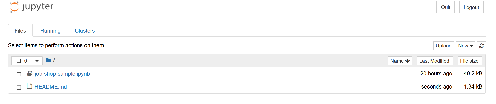

# Scheduling jobs with the Azure Quantum optimization service

## Introduction

This sample provides a comprehensive walkthrough of the job shop scheduling problem, from problem definition to formulation of penalty functions and finally solving the problem using the Azure Quantum Optimization Service.

By working through this sample, you will learn:

- What the job shop scheduling problem is and why it is important
- How to represent problem terms mathematically
- How to build penalty functions to represent problem constraints
- How to build an objective function to minimize the makespan
- How to transform these mathematical functions into code using the Azure Quantum Optimization Python SDK
- How to submit problem terms to Azure Quantum
- How to interpret the results
- How to validate the results
- How to tune the solver parameters

## Prerequisites

1. [Create an Azure Quantum Workspace](https://docs.microsoft.com/azure/quantum/how-to-create-quantum-workspaces-with-the-azure-portal)
2. [Install the `azure-quantum` Python module](https://docs.microsoft.com/azure/quantum/how-to-use-the-python-sdk)
3. (If you want to run the Jupyter notebook) [Install Jupyter Notebook](https://jupyter.org/install)
4. (Optional) [Run the basic ship loading sample](../ship-loading/)

## Running the sample

There are two ways to run the sample:

- [Jupyter Notebook (full sample walkthrough)](./job-shop-sample.ipynb)
- [Python script (barebones annotations)](./job-shop-sample.py)

### Running the Jupyter Notebook

To run this sample, use the commandline to navigate to the `job-shop-sample` folder and run `jupyter notebook`

Your web browser should automatically open a new window showing something similar to the below:

If this doesn't happen, copy the localhost link shown in the terminal window and paste it into your browser's address bar.

Once you see the page above, simply click on the `job-shop-sample.ipynb` link to open the sample notebook.

### Running the Python script

- Open up the `job-shop-sample.py` script using your favorite IDE or a text editor.
- Fill in your Azure Quantum workspace details at the beginning of the script.
- Run the script through your IDE or use the commandline to navigate to the `job-shop-sample` folder and then run `python ./job-shop-sample.py` or `python3 ./job-shop-sample.py` (depending on how your environment is set up).

### Manifest

- **[job-shop-sample.ipynb](https://github.com/microsoft/qio-samples/blob/main/samples/job-shop-scheduling/job-shop-sample.ipynb)**: Jupyter Notebook version of this sample.
- **[job-shop-sample.py](https://github.com/microsoft/qio-samples/blob/main/samples/job-shop-scheduling/shipping-sample.py)**: Standalone Python version of this sample.
