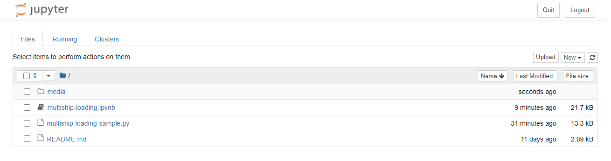

# Solving the ship loading problem with the Azure Quantum optimization service

## Introduction

This sample provides a comprehensive walkthrough of the multi-ship loading problem, from multiple sub-problem definitions to using the Azure Quantum Optimization Service to obtain results and help choose solver parameter. This is an intermediate-level sample.

By working through this sample, you will learn:

- How to tackle the multi-ship loading problem
- How to define two sub cost-functions and transform these mathematical functions into code using the Azure Quantum Optimization Python SDK
- How to submit problem terms to Azure Quantum
- How to obtain parameters returned from the parameter-free solvers for use with other parametrized solvers

Before approaching this sample, it is recommended that you complete the ship-loading sample, which can be found in this repository.

## Prerequisites

1. [Create an Azure Quantum Workspace](https://docs.microsoft.com/azure/quantum/how-to-use-the-python-sdk)
2. [Install the `azure-quantum` Python module](https://docs.microsoft.com/azure/quantum/how-to-use-the-python-sdk)
3. (If you want to run the Jupyter notebook) [Install Jupyter Notebook](https://jupyter.org/install)
4. [Complete the ship-loading sample](https://github.com/microsoft/qio-samples/tree/main/samples/ship-loading)

## Running the sample

There are two ways to run the sample:

- Jupyter Notebook (full sample walkthrough)
- Python script (barebones annotations)

### Running the Jupyter Notebook

To run this sample, use the commandline to navigate to the `multiship-loading-sample` folder and run `jupyter notebook`.

Your web browser should automatically open a new window showing something similar to the below:

If this doesn't happen, copy the localhost link shown in the terminal window and paste it into your browser's address bar.

Once you see the page above, simply click on the `multiship-loading.ipynb` link to open the sample notebook.

### Running the Python script

- Open up the `multiship-loading-sample.py` script using your favorite IDE or a text editor.
- Fill in your Azure Quantum workspace details at the beginning of the script.
- Run the script through your IDE or use the command line to navigate to the `shipping-sample` folder and then run `python ./multiship-loading-sample.py` or `python3 ./multiship-loading-sample.py` (depending on how your environment is set up).

## Manifest

- **[multiship-loading.ipynb](https://github.com/microsoft/qio-samples/blob/main/samples/multiship-loading-sample/multiship-loading.ipynb)**: Jupyter Notebook version of this sample.
- **[multiship-loading-sample.py](https://github.com/microsoft/qio-samples/blob/main/samples/multiship-loading-sample/multiship-loading-sample.py)**: Standalone Python version of this sample.
