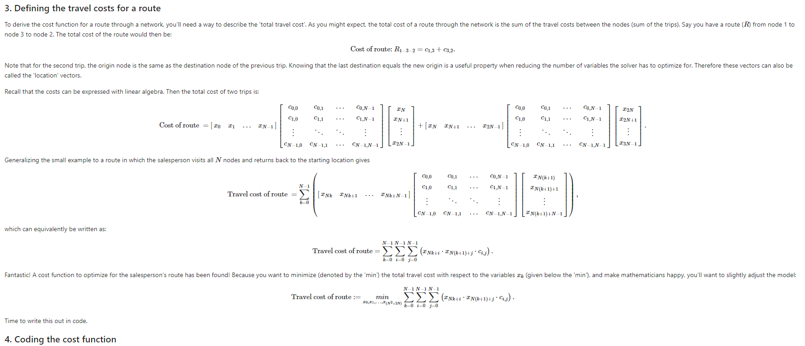
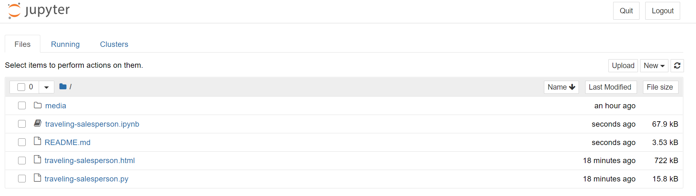

# Solving the traveling salesperson problem with the Azure Quantum optimization service

## Introduction

This sample provides a comprehensive walkthrough of the traveling salesperson problem, from problem definition to formulation of penalty functions and finally solving the problem using the Azure Quantum Optimization Service.

By working through this sample, you will learn:

- How to solve the traveling salesperson problem with Azure Quantum 
- Model the problem mathematically to design objective and penalty functions
- Coding of the optimization problem using the Azure Quantum Optimization Python SDK
- Verifying results returned by the solver
- Tips and references to help you choose solver settings

## Prerequisites

1. [Create an Azure Quantum Workspace](https://docs.microsoft.com/azure/quantum/how-to-create-quantum-workspaces-with-the-azure-portal)
2. [Install the `azure-quantum` Python module](https://docs.microsoft.com/azure/quantum/how-to-use-the-python-sdk)
3. (If you want to run the Jupyter notebook) [Install Jupyter Notebook](https://jupyter.org/install)
4. (Optional) [Run the basic ship loading sample](../ship-loading/)

## Running the sample

There are two ways to run the sample (.ipynb and .py):

- [Jupyter Notebook (step-by-step walkthrough)](./traveling-salesperson.ipynb)
- [Python script (barebones annotations)](./traveling-salesperson.py)

A html file of the Jupyter notebook is attached for improved readability:

- [Html script (more readable format than Jupyter Notebook)](./traveling-salesperson.html)

### Running the Jupyter Notebook

To run this sample, use the commandline to navigate to the `traveling-salesperson` folder and run `jupyter notebook`

Your web browser should automatically open a new window showing something similar to the below:

If this doesn't happen, copy the localhost link shown in the terminal window and paste it into your browser's address bar.

Once you see the page above, simply click on the `traveling-salesperson.ipynb` link to open the sample notebook.

### Running the Python script

- Open up the `traveling-salesperson.py` script using your favorite IDE or a text editor.
- Fill in your Azure Quantum workspace details at the beginning of the script.
- Run the script through your IDE or use the commandline to navigate to the `traveling-salesperson` folder and then run `python ./traveling-salesperson.py` or `python3 ./traveling-salesperson.py` (depending on how your environment is set up).

### Manifest

- **[traveling-salesperson.ipynb](https://github.com/microsoft/qio-samples/blob/main/samples/traveling-salesperson/traveling-salesperson.ipynb)**: Jupyter Notebook version of this sample.
- **[traveling-salesperson.py](https://github.com/microsoft/qio-samples/blob/main/samples/traveling-salesperson/traveling-salesperson.py)**: Standalone Python version of this sample.
- **[traveling-salesperson.html](https://github.com/microsoft/qio-samples/blob/main/samples/traveling-salesperson/traveling-salesperson.html)**: HTML version of this sample.
